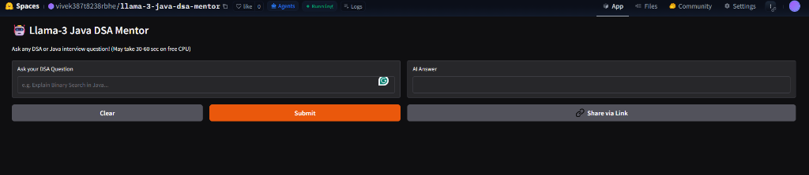

# 🤖 Llama-3 Java DSA Mentor



**Live Demo:** [Try the AI Mentor Here](https://huggingface.co/spaces/vivek387t8238rbhe/llama-3-java-dsa-mentor)
*(Note: Runs on a free CPU, please allow ~45-60s for inference)*

## 📌 Overview
This project is a fine-tuned Large Language Model specialized in answering Data Structures and Algorithms (DSA) questions using Java. I fine-tuned **Llama-3 (8B)** to act as an expert coding mentor, capable of explaining complex algorithms and providing clean, optimized Java solutions.

## 🛠️ Tech Stack
* **Base Model:** Meta Llama-3 (8B Instruct)
* **Fine-Tuning Library:** Unsloth (for 2x faster training and efficient memory usage)
* **Quantization:** GGUF (Q4_K_M) format for efficient CPU deployment
* **Frontend:** Gradio
* **Hosting:** Hugging Face Spaces & Models Hub

## 🚀 How I Built It
1. **Fine-Tuning:** Used Google Colab (T4 GPU) and the Unsloth library to perform LoRA fine-tuning on a curated dataset of DSA questions.
2. **Quantization:** Exported the trained model weights into the GGUF format to drastically reduce the model size (to ~4.9GB) while maintaining accuracy.
3. **Deployment:** Built a web interface using Gradio and deployed the model to Hugging Face Spaces for public access using `llama-cpp-python` for inference.

## 💻 Run it Locally
If you want to run this model instantly on your own machine using Ollama:
```bash
ollama run hf.co/vivek387t8238rbhe/llama-3-java-dsa-mentor-gguf
```
